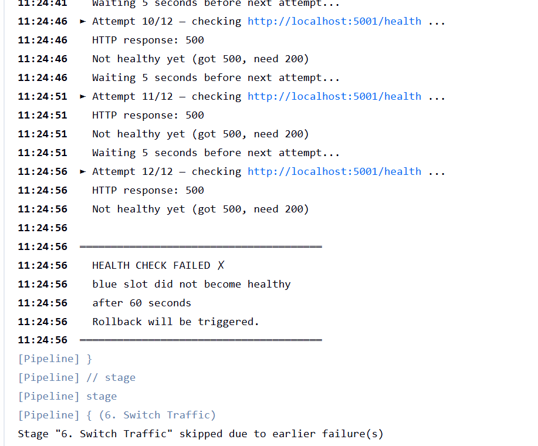
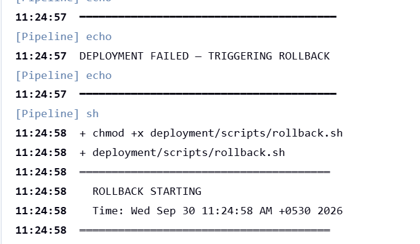
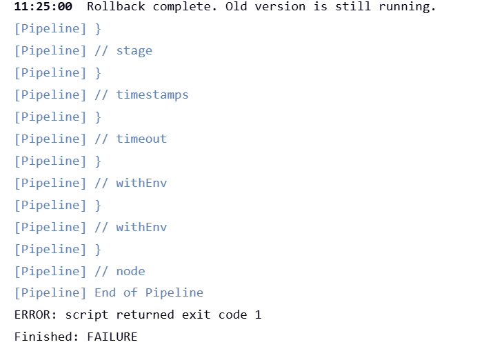
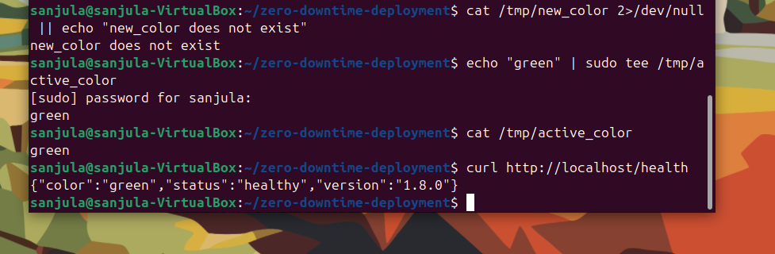
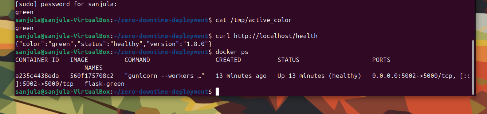
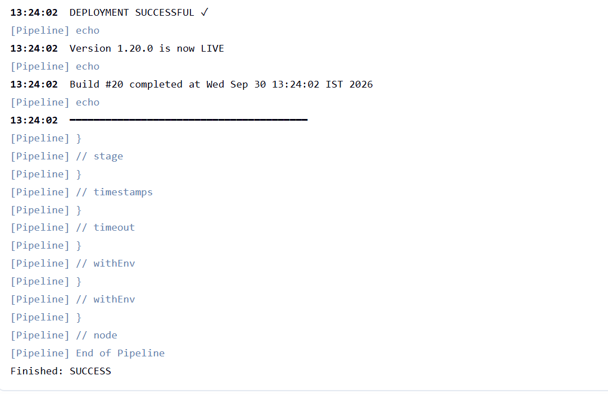

# Stage 2 — Failure Detection & Automatic Rollback

> **What this document proves:**
> A broken deployment is detected automatically. Jenkins stops it.
> Rollback runs without any human action.
> Users never see the broken version.

---

## What Problem Does This Solve?

Imagine you push a bad version to production at 3 AM.
Without an automated system, this happens:

```
Bad code pushed
      ↓
Old container stopped
      ↓
Bad container starts
      ↓
Users get errors ← everyone is affected
      ↓
Someone wakes up at 3 AM
      ↓
Manually rolls back
      ↓
20–60 minutes of downtime
```

**This system changes that completely:**

```
Bad code pushed
      ↓
Bad container starts in STANDBY (old still live)
      ↓
Health check detects the failure
      ↓
Jenkins marks build FAILED
      ↓
Rollback runs automatically
      ↓
Old version stays live the entire time
      ↓
Zero users affected. Zero downtime.
```

That is the engineering guarantee Stage 2 proves.

---

## System Architecture

```
┌─────────────────────────────────────────────────────────┐
│                    DEVELOPER MACHINE                     │
│                                                          │
│    git push origin main                                  │
│           │                                              │
└───────────┼──────────────────────────────────────────────┘
            │ GitHub webhook
            ▼
┌─────────────────────────────────────────────────────────┐
│                   JENKINS SERVER                         │
│                                                          │
│   ┌──────────────────────────────────────────────────┐  │
│   │              PIPELINE (6 stages)                  │  │
│   │                                                   │  │
│   │  1. Checkout → 2. Test → 3. Build Docker          │  │
│   │         │                                         │  │
│   │         ▼                                         │  │
│   │  4. Deploy to STANDBY slot                        │  │
│   │         │                                         │  │
│   │         ▼                                         │  │
│   │  5. Health Check ──── FAIL? ──→ Rollback.sh       │  │
│   │         │                           │             │  │
│   │         │ PASS                      │             │  │
│   │         ▼                           ▼             │  │
│   │  6. Switch Traffic        Old version stays live  │  │
│   └──────────────────────────────────────────────────┘  │
└─────────────────────────────────────────────────────────┘
            │
            ▼
┌─────────────────────────────────────────────────────────┐
│                UBUNTU VM (192.168.8.110)                 │
│                                                          │
│   ┌──────────┐      ┌──────────┐      ┌──────────────┐  │
│   │  Nginx   │      │  BLUE    │      │    GREEN     │  │
│   │ port 80  │─────▶│ port 5001│      │  port 5002   │  │
│   │          │      │ (ACTIVE) │      │  (STANDBY)   │  │
│   └──────────┘      └──────────┘      └──────────────┘  │
│                                                          │
│   State file: /tmp/active_color                          │
└─────────────────────────────────────────────────────────┘
```

### How Blue-Green Deployment Works

```
NORMAL STATE              DURING DEPLOYMENT         AFTER SWITCH
─────────────             ─────────────────         ────────────
Nginx → BLUE              Nginx → BLUE (unchanged)  Nginx → GREEN
BLUE = running v1.x       GREEN starts (v2.x)       GREEN = running v2.x
GREEN = stopped           Health check runs         BLUE = stopped
                          ↓
                          PASS → switch traffic
                          FAIL → rollback (stop GREEN, BLUE stays)
```

---

## The Health Check System

The health check is the brain of failure detection.

**Script:** `deployment/scripts/health-check.sh`

```
New container starts
        │
        ▼
  Wait 5 seconds
        │
        ▼
 curl /health endpoint
        │
     HTTP 200? ──── YES ──→ Attempt counter resets
        │                    Continue to Switch Traffic ✓
        NO
        │
 Attempt again (up to 12 times × 5 sec = 60 seconds max)
        │
 After 60 seconds still failing?
        │
        ▼
   exit 1 → Jenkins marks FAILED → Rollback triggered
```

**Health endpoint response (healthy):**
```json
{
  "status": "healthy",
  "version": "1.20.0",
  "color": "green"
}
```

**Health endpoint response (broken):**
```json
{
  "status": "unhealthy",
  "error": "Database connection failed",
  "version": "1.x.0"
}
HTTP 500
```

---

## What We Tested in Stage 2

### Test 1 — Health Check Failure + Automatic Rollback

**What we did:**
Deployed a container that intentionally returned HTTP 500 on `/health`.

**What the system did:**
```
11:24:41  Attempt 10/12 — HTTP response: 500 ✗
11:24:46  Attempt 11/12 — HTTP response: 500 ✗
11:24:51  Attempt 12/12 — HTTP response: 500 ✗
11:24:56  HEALTH CHECK FAILED ✗
11:24:56  Blue slot did not become healthy after 60 seconds
11:24:56  Rollback will be triggered.
11:24:57  DEPLOYMENT FAILED — TRIGGERING ROLLBACK
11:24:58  ROLLBACK STARTING
```

**Evidence:** Screenshot 01, 02, 03

---

### Test 2 — Docker Build Failure Stops Deployment

**What we did:**
Introduced an intentionally broken Dockerfile (invalid base image).

**What the system did:**
```
Stage 3: Build Docker Image → FAILED ✗
Pipeline stopped immediately.
No container was ever deployed.
No health check ran.
Old version was never touched.
```

**Evidence:** Screenshot 06 (build failure log)

> **Key lesson:** The safety net has multiple layers.
> A broken Docker build is caught at Stage 3 — before
> a broken container ever starts. Users are never at risk.

---

### Test 3 — Successful Redeployment After Failures

**What we did:**
After all failure tests were complete, restored the healthy code and triggered a clean deployment.

**What the system did:**
```
13:24:02  DEPLOYMENT SUCCESSFUL ✓
13:24:02  Version 1.20.0 is now LIVE
13:24:02  Build #20 completed at Wed Sep 30 13:24:02 IST 2026
Finished: SUCCESS
```

**Evidence:** Screenshot 06 (07-successful-redeploy.png)

This proves:
- The system fully recovers after failures
- Rollback does not break future deployments
- The pipeline is resilient

---

## Evidence — Ordered by Event

### Screenshot 01 — Health Check Detecting Failure



**What you see:**
- 12 attempts over 60 seconds
- Every attempt: `HTTP response: 500`
- Final message: `HEALTH CHECK FAILED ✗`
- `Stage "6. Switch Traffic" skipped due to earlier failure(s)`

**What this proves:**
The system never switched Nginx. Users were never sent to the broken container.

---

### Screenshot 02 — Rollback Automatically Triggered



**What you see:**
- `DEPLOYMENT FAILED — TRIGGERING ROLLBACK`
- Jenkins automatically calls `rollback.sh`
- `ROLLBACK STARTING` begins immediately

**What this proves:**
No human action was needed. The system detected failure and responded on its own.

---

### Screenshot 03 — Build Marked FAILED + Rollback Complete



**What you see:**
- `Rollback complete. Old version is still running.`
- `Finished: FAILURE`

**What this proves:**
Jenkins correctly recorded the build as failed (for audit trail), while simultaneously confirming the old version is safe.

---

### Screenshot 04 — Old Version Still Live After Rollback



**What you see:**
```bash
curl http://localhost/health
{"color":"green","status":"healthy","version":"1.8.0"}
```

**What this proves:**
After rollback, the old version (v1.8.0, green slot) is still responding correctly. Users experienced zero interruption.

---

### Screenshot 05 — Docker State After Rollback



**What you see:**
- Only `flask-green` is running (the original)
- The failed deployment container was removed
- Status: `Up 13 minutes (healthy)`

**What this proves:**
The failed container is completely cleaned up. No leftover containers. System is in a clean state.

---

### Screenshot 06 — Successful Redeployment Confirmed



**What you see:**
- `DEPLOYMENT SUCCESSFUL ✓`
- `Version 1.20.0 is now LIVE`
- `Build #20 completed`
- `Finished: SUCCESS`

**What this proves:**
After all failure tests, the system recovered and performed a clean deployment. The pipeline is fully functional.

---

## What You Learn From Stage 2

### Lesson 1 — Automated systems don't sleep

A human might miss a failed deployment at 3 AM.
The health check runs in 60 seconds, detects the failure, and rolls back — every time, automatically.

### Lesson 2 — Defense in depth

The pipeline has multiple failure points that protect users:

```
Stage 2: Tests fail?         → Stop. Nothing deployed.
Stage 3: Docker build fails? → Stop. Nothing deployed.
Stage 5: Health check fails? → Stop. Rollback. Old version stays.
Stage 6: Traffic switch?     → Only happens if Stage 5 passed.
```

Users are only ever moved to a new version **after it has passed the health check**.

### Lesson 3 — State management is critical

The system tracks which slot is active in `/tmp/active_color`.
If the file has wrong ownership (e.g., `root` instead of `jenkins`), the pipeline fails.
This is a real-world lesson: permissions matter in automation.

### Lesson 4 — Rollback is not a special mode

Rollback is just "stop the new container, do nothing else".
Because Nginx was never changed, the old version was always live.
There is nothing to undo — the system never switched.

```
ROLLBACK = stop failed container
         + verify old container running
         + (Nginx unchanged, so old version still live automatically)
```

---

## Stage 2 Completion Checklist

| Test | Result |
|------|--------|
| Health check detects HTTP 500 from new container | ✅ Proven (Build failed at Stage 5) |
| Jenkins build marked FAILED | ✅ Proven (Finished: FAILURE) |
| Rollback script triggered automatically | ✅ Proven (11:24:57 log entry) |
| Failed container removed | ✅ Proven (docker ps shows only flask-green) |
| Old version still serving users | ✅ Proven (curl returns v1.8.0 healthy) |
| Docker build failure stops deployment | ✅ Proven (Stage 3 failure, no container started) |
| Successful redeployment after failures | ✅ Proven (Build #20 SUCCESS, v1.20.0 LIVE) |

---

## Stage 2 Result

**All 7 tests passed.**

The system correctly detects failures at two layers (build time and runtime), automatically rolls back without human intervention, and fully recovers for future deployments.

**Stage 2 is complete.**

---

*Next: Stage 3 — Zero-Downtime Proof (100 live requests during active deployment)*
